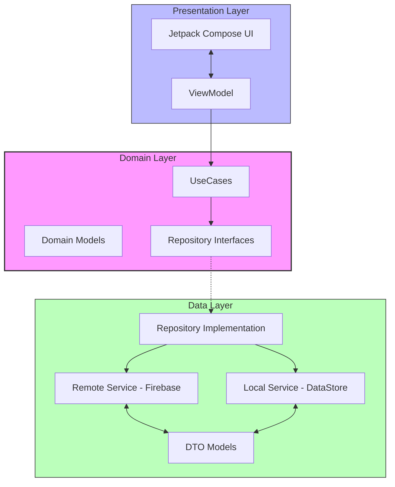

# Project Structure & Architecture

This document describes the modules and packages used in the Optical Specs E-Commerce App and their respective purposes.

## Module Overview

The project is currently a single-module Android application.

- **`:app`**: The main Android application module containing all the source code, resources, and configuration.

## Package Structure (Clean Architecture)

The source code is organized following **Clean Architecture** principles, located under `com.opticalshop`.

### 1. `domain`
The core of the application. It is independent of any other layer and contains the business logic.
- **`model`**: Business entities (e.g., `Product`, `User`, `Review`).
- **`usecase`**: Fine-grained business logic components (e.g., `GetProductsUseCase`, `LoginUseCase`).
- **`repository`**: Interfaces defining how the data layer should behave.

### 2. `data`
The implementation layer for data retrieval and persistence.
- **`model`**: Data Transfer Objects (DTOs) used for API/Firebase communication.
- **`remote`**: Firebase Firestore, Auth, and Storage service implementations.
- **`preferences`**: Local storage using DataStore (e.g., user theme, session info).
- **`repository`**: Concrete implementations of the interfaces defined in the `domain` layer.

### 3. `presentation`
The UI layer responsible for displaying data and handling user interactions.
- **`screens`**: Composable functions for each screen (Home, Login, Product Details, etc.).
- **`components`**: Reusable UI components used across multiple screens.
- **`navigation`**: Navigation graph and route definitions.
- **`theme`**: Design system (Colors, Typography, Shapes).
- **`viewmodel`**: Managing UI state and communicating with the `domain` layer.

### 4. `di` (Dependency Injection)
- Hilt modules for providing dependencies across the app (Room, Firebase, Repositories).

### 5. `service` & `utils`
- Background services and helper/utility functions.

## Key Libraries & Dependencies (External Packages)

The following external libraries are used to extend the app's functionality:

| Package / Library | Purpose |
| :--- | :--- |
| **Jetpack Compose** | Modern toolkit for building native Android UI. |
| **Firebase (Auth, Firestore, Storage)** | Backend infrastructure for authentication, real-time database, and file storage. |
| **Hilt (Dagger)** | Dependency injection framework to manage object lifecycles. |
| **Kotlin Coroutines / Flows** | Handling asynchronous tasks and reactive data streams. |
| **Compose Navigation** | Managing screen transitions and deep linking. |
| **Coil** | Image loading and caching for remote images. |
| **DataStore** | Modern data storage solution for local preferences (replacing SharedPreferences). |
| **Lottie** | Rendering vector animations exported from Adobe After Effects. |
| **Accompanist** | Helper libraries for Jetpack Compose (e.g., System UI Controller). |

---

## Architecture Flow Chart

The following diagram illustrates the interaction between the different layers and packages:

## Data Flow Summary

1. **User Interaction**: User clicks a button in a **Composable**.
2. **ViewModel Event**: The Composable calls a function in the **ViewModel**.
3. **UseCase Execution**: The ViewModel executes a **UseCase**.
4. **Repository Call**: The UseCase calls a **Repository Interface**.
5. **Data Source Fetch**: The **Repository Implementation** fetches data from **Firebase (Remote)** or **DataStore (Local)**.
6. **State Update**: The data flows back up as **Domain Models**, and the **ViewModel** updates the UI state.
7. **UI Recomposition**: **Jetpack Compose** automatically updates the UI to reflect the new state.

