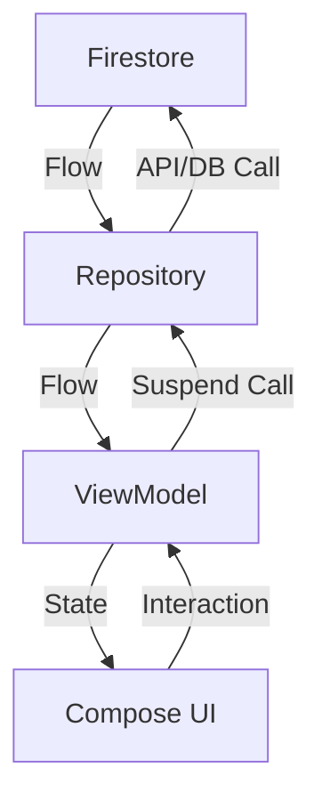

# Data Flow Documentation

## Reactive Flow
The application uses a reactive data flow powered by **Kotlin Flows** to ensure real-time updates and a responsive UI.

### 1. Data Retrieval (Bottom-Up)
1. **Firestore Service**: Listens to real-time updates from Firebase using `callbackFlow` or `snapshotListener`.
2. **Repository**: Maps the raw Firestore data to domain models and wraps it in a `Result` (Success, Error, Loading).
3. **UseCase**: (Optional) Further transforms or combines data if needed.
4. **ViewModel**: Collects the flow from the Repository/UseCase and updates a `mutableStateOf` or `StateFlow`.

### 2. UI Updates (Top-Down)
1. **Composables**: Observe the ViewModel state.
2. **Recomposition**: When the state changes, Jetpack Compose automatically re-renders the minimum necessary UI components.

### 3. User Actions
1. **Input**: User interacts with a Composable (e.g., clicks "Add to Cart").
2. **Event**: The Composable calls a function on the ViewModel.
3. **Logic**: The ViewModel launches a coroutine and calls the appropriate UseCase or Repository.
4. **Persistence**: The Repository updates Firestore or DataStore, triggering a new data flow cycle.

## Diagram (Conceptual)

